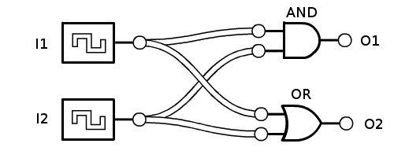
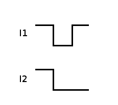

Verilog Compiler
================

Using a Verilog file (in case you don't know: it'a a hardware description language that allow us to represents circuits) this script verifies its syntax and using the input states described on the "wave in" file it generates the respective output state. 

You can run using:
```
python3 compiler.py [VERILOG FILE] [WAVE IN FILE]
```

## Example

If you have no clue about what I'm talking let me give you an example:

1. First we need a circuit (and a Verilog file that describe it)!

Circuit:


Respective Verilog description of the circuit (let's name it verilog.v):
```
module Exemplo(I1, I2, O1, O2);

input I1, I2;
output O1, O2;

and AND(O1, I1, I2);
or OR(O2, I1, I2);

endmodule
```

2. We need the input waves:

Input waves:


Respective python file to represent them (let's name it wave_in.py):
```
wave_in_base = [
	['I1', [1, 0, 1]],
	['I2', [1, 0, 0]]
]
```

3. It's done! We just need to run this example:

```
python3 compiler.py verilog.v wave_in.py
```

and we will get:
```
{'O2': [1, 0, 1], 'O1': [1, 0, 0]}
```